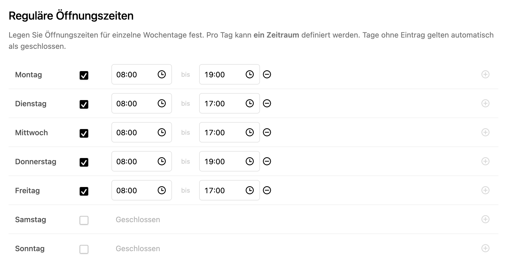

# We Are Open

A Kirby panel plugin for managing regular opening hours — straight from the panel, no YAML editing required.



**Free** covers the everyday case: one time slot per weekday. **[We Are Open PRO](#we-are-open-pro)** adds multiple slots per day, exception days, and public holidays that keep themselves up to date. It's early access — [request it by email](mailto:plugins@gearsdigital.com).

## Contents

- [Requirements](#requirements)
- [Installation](#installation)
- [Configuration](#configuration)
- [Documentation](#documentation)
  - [Site method](#site-method)
  - [KirbyTags](#kirbytags)
  - [Snippets](#snippets)
- [We Are Open PRO](#we-are-open-pro)
- [Development](#development)
- [License](#license)

## Requirements

- Kirby CMS >= 4.0
- PHP >= 8.3

## Installation

### Composer

```bash
composer require gearsdigital/we-are-open
```

### Manual

Download and copy this repository to `/site/plugins/we-are-open`.

## Configuration

```php
// config/config.php
return [
    'gearsdigital.we-are-open.defaultStartTime' => '08:00:00',
    'gearsdigital.we-are-open.defaultEndTime'   => '17:00:00',
    'gearsdigital.we-are-open.timezone'         => 'Europe/Berlin',
];
```

## Documentation

### Site method

#### `site()->weAreOpen()`

Returns a `WeAreOpenFacade` instance for accessing opening hours in templates and snippets.

##### `->businessHours()`

Returns this week's opening hours as an array of `BusinessHoursDay` objects, one per weekday (Mon–Sun).

```php
$hours = site()->weAreOpen()->businessHours();

foreach ($hours as $day) {
    echo $day->label; // "Monday"
    foreach ($day->slots as $slot) {
        echo $slot->start . '–' . $slot->end; // "08:00:00–17:00:00"
    }
}
```

See [Snippets](#snippets) for all available properties on `BusinessHoursDay` and `TimeRange`.

### KirbyTags

#### `(scheduleTable:)`

Renders a formatted table of your weekly opening hours.

```
(scheduleTable:)
(scheduleTable: showClosed: true timeFormat: H:i)
```

**Options**

| Option | Default | Description |
|--------|---------|-------------|
| `layout` | — | CSS class added as `is-layout-{value}` on the table element. Pass any string — no functional effect in the Free version. |
| `showClosed` | `false` | Include days marked as closed in the output |
| `timeFormat` | `G:i` | PHP [`date()`](https://www.php.net/manual/en/function.date.php) format string for time output — e.g. `H:i` (09:00), `g:ia` (9:00am) |

### Snippets

Kirby resolves snippets from `site/snippets/` before falling back to plugin-provided ones. To override any snippet, copy the file from the plugin into the matching path under `site/snippets/` and edit it freely — plugin updates will never overwrite your version.

```
site/snippets/
└── we-are-open/
    └── business-hours-table.php   ← your custom version
```

#### `we-are-open/business-hours-table`

Renders the `(scheduleTable:)` output.

**Variables**

| Variable | Type | Description |
|----------|------|-------------|
| `$tableData` | `BusinessHoursDay[]` | One entry per weekday — see properties below |
| `$options` | `array` | Normalised options passed to the tag |
| `$tag` | `KirbyTag\|null` | The originating KirbyTag instance |

**`BusinessHoursDay` properties**

| Property | Type | Description |
|----------|------|-------------|
| `$day->label` | `string` | Localised weekday name (e.g. `Monday`) |
| `$day->slots` | `TimeRange[]` | Raw time slots as stored |
| `$day->formattedSlots` | `TimeRange[]` | Time slots formatted according to `timeFormat` option |
| `$day->weekday` | `Weekday` | Weekday value object — cast to string for `mon`–`sun` |

**`TimeRange` properties** (each item in `slots` / `formattedSlots`)

| Property | Type | Description |
|----------|------|-------------|
| `$slot->start` | `string` | Start time (e.g. `09:00`) |
| `$slot->end` | `string` | End time (e.g. `17:00`) |

**Formatting tips**

Use `$day->formattedSlots` for times already formatted by the `timeFormat` option. Use `$day->slots` for the raw `HH:MM:SS` value to apply your own format:

```php
// Custom time format in a snippet
$start = date('H:i', strtotime($slot->start)); // → "09:00"
$start = date('g:ia', strtotime($slot->start)); // → "9:00am"
```

The weekday is available as a two-letter code (`mon`–`sun`) via `$day->weekday`. Use it with PHP's `date()` to get a localised name:

```php
// Custom weekday label in a snippet
$label = date('l', strtotime('next ' . $day->weekday)); // → "Monday"
$label = date('D', strtotime('next ' . $day->weekday));  // → "Mon"
```

For localised names that respect the site language, `$day->label` already contains the correct translation.

## We Are Open PRO

Free covers most single-location schedules well. **We Are Open PRO** is for
the cases that don't fit a single time slot per day: lunch breaks, split
shifts, seasonal closures, and public holidays that shouldn't need a yearly
reminder.

- **Multiple time slots per day** — split a day into two or more open
  windows, e.g. 9:00–12:00 and 14:00–18:00 for a lunch break, instead of one
  continuous slot.
- **Exception days** — override the regular schedule for a single date: a
  training day, a spontaneous closure, a one-off late opening.
- **Exception day ranges** — the same override, spanning a start and end
  date: company holidays, renovations, seasonal closures.
- **Public holiday detection** — pick a country and public holidays are
  added automatically, kept up to date every year. Any holiday can still
  get its own hours if you're open anyway.
- **`(openNote:)` KirbyTag** — a short, self-updating status line (open,
  closed, or opening soon) for headers, banners, or a contact page.
- **Extended `scheduleTable` options** — more control over the rendered
  table beyond the Free set.

| Feature | Free | Pro |
|---------|:----:|:---:|
| Regular opening hours | ✅ | ✅ |
| One time slot per day | ✅ | ✅ |
| `(scheduleTable:)` KirbyTag | ✅ | ✅ |
| Multiple time slots per day | — | ✅ |
| Exception days | — | ✅ |
| Exception day ranges | — | ✅ |
| Public holiday detection | — | ✅ |
| `(openNote:)` KirbyTag | — | ✅ |
| Extended `scheduleTable` options | — | ✅ |

> **Early access.** We Are Open PRO isn't publicly released yet. The
> fastest way to get it is to email
> [plugins@gearsdigital.com](mailto:plugins@gearsdigital.com) — we'll
> get you set up directly.

## Development

```bash
# Development with watch mode
npm run dev

# Production build
npm run build
```

## License

[MIT](LICENSE)
